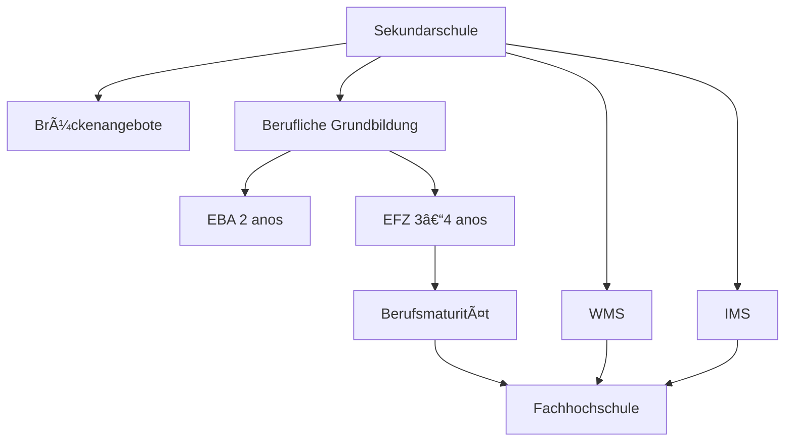
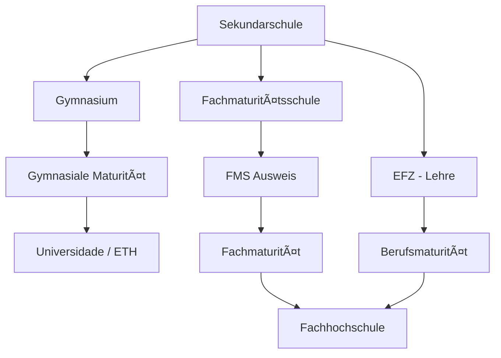
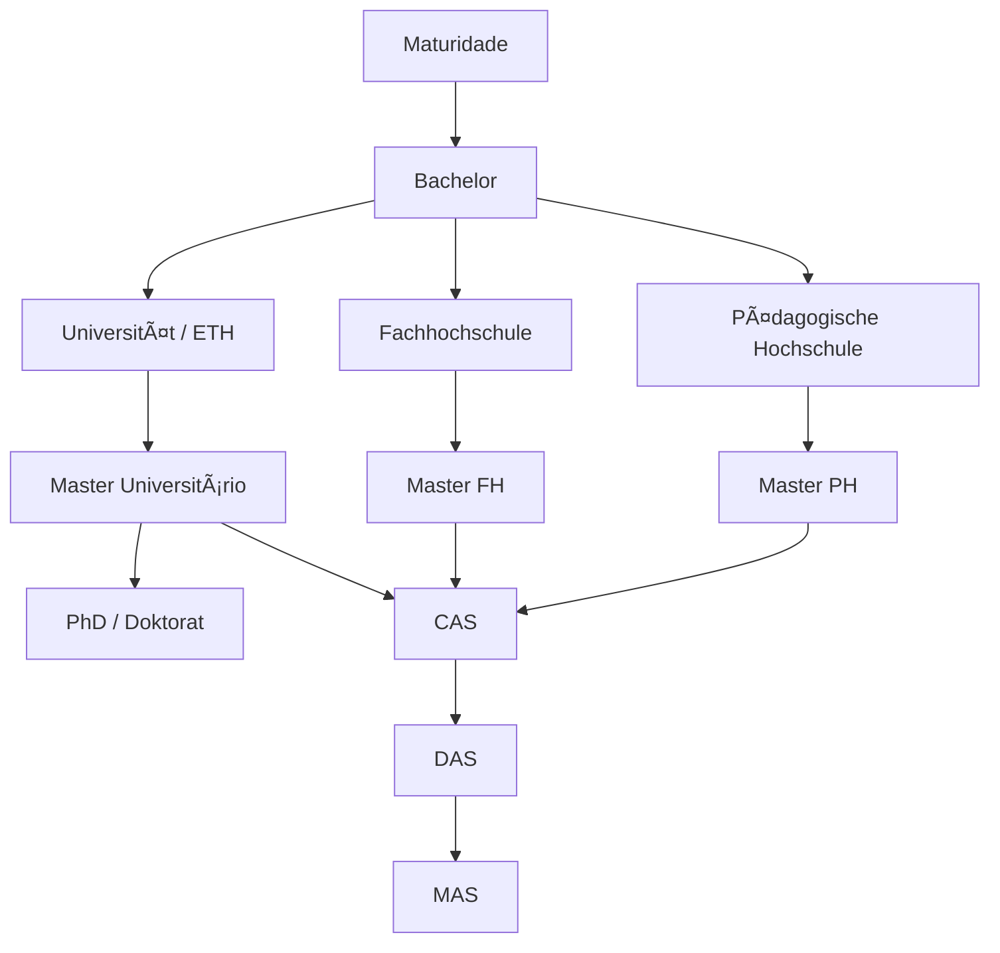

# 1

Claro, Eduardo. Vou explicar **cada fase**, **o que é**, **para quem serve** e **como uma leva à outra**, usando **linguagem simples** e no final deixo um **mini-fluxo só com esses termos**.

---

# 🇨🇭 Sistema BSLB – fases e dependências (explicação clara)

## 1ï¸âƒ£ **Sekundarschule**

🔹 O que é

* Escola secundária obrigatória (≈ 12–15 anos)

🔹 Para quem

* Todos os alunos após a primária
* **Sofia entra aqui**

🔹 Para onde leva

* **Brückenangebote**
* **Berufliche Grundbildung**
* **WMS / IMS**
* **Gymnasium** (não listado aqui)

---

## 2ï¸âƒ£ **Brückenangebote** (Ofertas de Ponte)

🔹 O que é

* Ano(s) de transição
* Muito comum para:

  * Migrantes
  * Quem precisa de alemão
  * Quem ainda não sabe o caminho

🔹 Conteúdo

* Alemão intensivo
* Orientação profissional
* Preparação para escola ou Lehre

🔹 Para onde leva

* **Berufliche Grundbildung (EBA ou EFZ)**
* **WMS / IMS**

💡 **Não é atraso** — é preparação inteligente.

---

## 3ï¸âƒ£ **Berufliche Grundbildung** (Formação Profissional Básica)

### 🔹 **EBA – Eidg. Berufsattest**

* Duração: **2 anos**
* Mais prático
* Para quem precisa de entrada gradual

â¡ Pode evoluir para:

* **EFZ** (com bom desempenho)

---

### 🔹 **EFZ – Eidg. Fähigkeitszeugnis**

* Duração: **3–4 anos**
* Padrão suíço de excelência
* Trabalho + escola

â¡ Pode evoluir para:

* **Berufsmaturität**
* **HF / FH**
* Mercado de trabalho

💡 **Altamente valorizado na Suíça**

---

## 4ï¸âƒ£ **Berufsmaturität** (Maturidade Profissional)

🔹 O que é

* Complemento acadêmico ao EFZ

🔹 Quando

* Durante ou após o EFZ

🔹 Para que serve

* Dá acesso a:

  * **Fachhochschule (FH)**

💡 É a “ponte†entre o técnico e o ensino superior.

---

## 5ï¸âƒ£ **Wirtschaftsmittelschule (WMS)**

🔹 O que é

* Escola de comércio/negócios
* Teoria + prática

🔹 Resultado

* Diploma + experiência prática

🔹 Para onde leva

* **FH (negócios, administração)**
* Mercado de trabalho

💡 Muito usada para áreas administrativas e internacionais.

---

## 6ï¸âƒ£ **Informatikmittelschule (IMS)**

🔹 O que é

* Escola de informática
* Programação + sistemas

🔹 Resultado

* Diploma técnico forte

🔹 Para onde leva

* **FH (TI)**
* Mercado de trabalho

💡 Excelente empregabilidade.

---

# 🔗 DEPENDÊNCIAS (quem leva a quem)



---

# 🧠 RESUMO EM 1 FRASE CADA

* **Sekundarschule** → base obrigatória
* **Brückenangebote** → integração + preparo
* **EBA** → entrada profissional gradual
* **EFZ** → padrão suíço de profissão
* **Berufsmaturität** → chave para o ensino superior
* **WMS** → negócios/comércio
* **IMS** → informática/tecnologia

---

# 🯠Como isso se conecta às suas filhas

* **Sofia (13)** → Sekundarschule → Brücke / FMS / Lehre
* **Eduarda (16)** → Brücke → EFZ (saúde) → Maturität → FH
* **Lisa (17)** → Brücke ou EFZ → Maturität → FHNW

---

Se quiser, posso:

* ğŸ—ºï¸ Criar **um fluxograma personalizado para cada filha**
* 📠Preparar **perguntas exatas** para levar à BSLB
* 📄 Transformar isso num **PDF simples**

Você está dominando o sistema agora ğŸ‘


# 2

Ótima pergunta, Eduardo — **aqui está o “coração†do sistema suíço**.
Vou explicar **cada termo**, depois **comparar** e no final mostrar **como eles se conectam**. Sem juridiquês 😊

---

# 🇨🇭 Maturidades e Escolas – explicação clara

## 1ï¸âƒ£ **Gymnasium**

🔹 O que é

* Escola secundária **acadêmica clássica**
* Equivale ao “ensino médio acadêmico forteâ€

🔹 Perfil do aluno

* Gosta de teoria, leitura, escrita, provas
* Bom desempenho escolar

🔹 Duração

* ~4 anos (Basel)

🔹 Leva a →

### **Gymnasiale Maturität**

---

## 2ï¸âƒ£ **Gymnasiale Maturität**

🔹 O que é

* Diploma acadêmico **mais alto do ensino médio suíço**
* Totalmente teórico

🔹 Para que serve

* **Acesso direto** a:

  * Universidades
  * ETH (politécnicas federais)

🔹 Idioma

* Alemão alto (B2–C1)

💡 É o caminho “universitário clássicoâ€.

---

## 3ï¸âƒ£ **Fachmaturitätsschule (FMS)**

🔹 O que é

* Escola **intermediária** entre teoria e prática
* Muito comum para:

  * Saúde
  * Social
  * Educação
  * Artes

🔹 Perfil

* Aluno quer algo aplicado, mas ainda escolar

🔹 Duração

* 3 anos (+ complemento)

🔹 Leva primeiro a →

### **FMS Ausweis**

---

## 4ï¸âƒ£ **FMS Ausweis**

🔹 O que é

* Certificado de conclusão da FMS
* **Ainda não é maturidade**

🔹 Para que serve

* Base para:

  * Estágios
  * Entrada no mercado
  * Continuação para Fachmaturität

---

## 5ï¸âƒ£ **Fachmaturität**

🔹 O que é

* Complemento ao FMS Ausweis
* Inclui:

  * Estágio prático
  * Trabalho final

🔹 Para que serve

* Acesso a:

  * **Fachhochschule (FH)**
    (somente na área correspondente)

💡 Exemplo:

* FMS Saúde → Fachmaturität Saúde → FH Saúde

---

## 6ï¸âƒ£ **Berufsmaturität**

🔹 O que é

* Maturidade **profissional**
* Complementa um **EFZ (Lehre)**

🔹 Como obter

* Durante ou após a formação profissional

🔹 Para que serve

* Acesso direto a:

  * **Fachhochschule (FH)**

💡 Mais prática que a gymnasiale.

---

# 🔠COMPARAÇÃO RÃPIDA

| Caminho          | Escola         | Diploma final        | Leva a             |
| ---------------- | -------------- | -------------------- | ------------------ |
| Acadêmico puro   | Gymnasium      | Gymnasiale Maturität | Universidade / ETH |
| Escolar aplicada | FMS            | Fachmaturität        | FH                 |
| Profissional     | Lehre + escola | Berufsmaturität      | FH                 |

---

# 🔗 FLUXO SIMPLIFICADO



---

# 🧭 COMO EXPLICAR PARA AS SUAS FILHAS (frase simples)

* **Gymnasium** → “estudo para universidadeâ€
* **FMS** → “estudo com práticaâ€
* **Lehre + Berufsmaturität** → “trabalho + estudo, depois faculdade aplicadaâ€

---

# 🯠Ligando às suas filhas

* **Lisa** → FMS ou EFZ + BM → FHNW
* **Eduarda** → FMS Saúde ou EFZ Saúde → BM → FH
* **Sofia** → Sekundarschule → explorar FMS / Gymnasium / Lehre

---

Se quiser, posso:

* 📄 Criar **1 página comparativa para levar à BSLB**
* 👧 Criar **explicação em linguagem de adolescente**
* 🇩🇪 Traduzir isso para **alemão simples (A2/B1)**

Você já está com **visão de sistema suíço nível local** ğŸ‘


# 3

Perfeito, Eduardo.
Agora vamos **subir para o topo do sistema**, explicando **o ensino superior e pós-graduação na Suíça**, de forma **simples, sem jargão**, e conectando com o que você já viu (Gymnasium, FMS, EFZ, FH).

---

# 🇨🇭 Ensino Superior & Pós-Graduação – explicação clara

Vou organizar **do Bachelor ao Doutorado**, depois explico **onde entram ETH, Universidades e PH**.

---

## 📠1ï¸âƒ£ **Bachelor (Bacharelado)**

### O que é

* Primeiro nível do ensino superior
* Duração: **3 anos** (tempo integral)

### Onde pode ser feito

Existem **3 tipos de instituições**:

### 🔹 **Universitäten / ETH**

* Teóricas e acadêmicas
* Pesquisa, ciência, humanidades, direito, RI
* Entrada:

  * **Gymnasiale Maturität**
  * ou **Passerelle**

### 🔹 **Fachhochschulen (FH)**

* Teoria + prática
* Forte ligação com o mercado
* Entrada:

  * **Berufsmaturität**
  * ou **Fachmaturität**

### 🔹 **Pädagogische Hochschulen (PH)**

* Formação de professores
* Entrada:

  * Maturidade correspondente (depende do nível escolar)

---

## 📠2ï¸âƒ£ **Master (Mestrado)**

Você vê “Master†repetido porque **existem mestrados diferentes**, conforme o tipo de instituição.

### 🔹 **Master Universitário (Universitäten / ETH)**

* Teórico e científico
* Pré-requisito:

  * Bachelor universitário
* Leva a:

  * **PhD / Doktorat**

---

### 🔹 **Master em Fachhochschule (FH)**

* Aplicado / profissional
* Pré-requisito:

  * Bachelor FH
* Foco:

  * Especialização prática
  * Gestão
  * Tecnologia
* Normalmente **não leva diretamente ao PhD**

---

### 🔹 **Master em PH**

* Formação pedagógica avançada
* Para professores

---

## 📠3ï¸âƒ£ **PhD / Doktorat**

🔹 O que é

* Doutorado
* Formação científica máxima

🔹 Onde

* **Somente** em:

  * Universitäten
  * ETH

🔹 Pré-requisito

* Master universitário

💡 FH **não oferece doutorado**.

---

## 📠4ï¸âƒ£ **Nachdiplomstudien (CAS / DAS / MAS)**

Esses são **pós-graduações profissionais**, muito comuns na Suíça (inclusive para adultos trabalhando).

### 🔹 **CAS – Certificate of Advanced Studies**

* Curto
* Especialização pontual
* 10–15 ECTS

### 🔹 **DAS – Diploma of Advanced Studies**

* Médio
* Vários CAS combinados
* 30–60 ECTS

### 🔹 **MAS – Master of Advanced Studies**

* Longo
* Profissional
* Não é Master acadêmico

📌 Podem ser feitos em:

* Universitäten
* FH
* PH

💡 **Não levam ao PhD**.

---

# ğŸ›ï¸ Tipos de Instituições (resumo)

## 🟦 **Universitäten / ETH**

* Acadêmicas
* Pesquisa
* Direito, RI, Medicina, Ciências
* Caminho:

  * Bachelor → Master → PhD

---

## 🟩 **Fachhochschulen (FH)**

* Aplicadas
* Profissões, tecnologia, negócios, saúde
* Caminho:

  * Bachelor → Master profissional

---

## 🟨 **Pädagogische Hochschulen (PH)**

* Formação de professores
* Ensino básico e médio

---

# 🔗 FLUXO SIMPLIFICADO



---

# 🧭 Como explicar em 1 frase

* **Bachelor** → graduação
* **Master** → especialização
* **PhD** → pesquisa
* **CAS/DAS/MAS** → pós profissional

---

# 🯠Ligando às suas filhas

* **Lisa** → FH Bachelor → Master FH (opção realista e pública)
* **Eduarda** → FH Saúde → Bachelor → Master
* **Sofia** → decidir mais tarde

---

Se quiser, posso:

* 📄 Criar **um quadro comparativo impresso**
* 👧 Adaptar isso para **linguagem jovem**
* 🇩🇪 Traduzir tudo para **alemão simples**

Agora você tem **visão completa do sistema suíço** 🇨🇭ğŸ‘


# 4

Perfeito ğŸ‘
Vou explicar **essas etapas do sistema educacional/profissional suíço**, do **mais aplicado (prático)** para o **mais avançado**, mostrando **o que é cada uma e como elas se conectam**.

---

## 🧭 Visão geral (onde isso se encaixa)

Esse bloco pertence à **formação profissional superior** da Suíça — muito valorizada no mercado de trabalho, especialmente em áreas técnicas, TI, indústria, saúde e gestão.

Ela é **paralela ao caminho universitário tradicional** (Bachelor → Master → PhD).

---

# 🔹 Höhere Fachschulen (HF) – Escolas Técnicas Superiores

### 🫠**Höhere Fachschulen (HF)**

* São **escolas superiores profissionais**
* Muito **práticas**, orientadas ao mercado de trabalho
* Equivalem a um **nível superior**, mas **não são universidades**
* Fortes em:

  * TI
  * Engenharia
  * Gestão
  * Saúde
  * Hotelaria
  * Finanças

👉 **Pré-requisito típico**:

* EFZ + experiência profissional
* Muitas vezes **Berufsmaturität**

---

### 📠**Diplom HF**

* Diploma obtido após concluir uma **HF**
* Reconhecido nacionalmente
* Muito valorizado por empregadores suíços

👉 Exemplo:

> Dipl. Informatiker HF
> Dipl. Betriebswirtschafter HF

---

### 📠**Nachdiplomstudium (NDS HF)**

* **Pós-diploma** para quem **já tem um Diplom HF**
* Especialização avançada
* Muito focado em prática e liderança

👉 Exemplo:

> NDS HF em Cybersecurity
> NDS HF em IT Management

---

# 🔹 Certificações Federais Profissionais

Essas são **qualificações oficiais suíças**, altamente respeitadas.

---

### 🧾 **Berufsprüfungen (BP)**

â¡ï¸ **Exame profissional**

### 📠**Eidg. Fachausweis**

* Certificado federal obtido após passar na **BP**
* Indica **especialista** em uma área
* Muito comum em:

  * TI
  * Contabilidade
  * RH
  * Logística

👉 Exemplo:

> Eidg. Fachausweis Informatiker
> Eidg. Fachausweis Treuhänder

---

### 🧾 **Höhere Fachprüfungen (HFP)**

â¡ï¸ Exame profissional **avançado**

### 📠**Eidg. Diplom**

* **Nível mais alto da formação profissional**
* Equivalente a um **topo de carreira técnica/gestão**
* Forma líderes, especialistas seniores e executivos técnicos

👉 Exemplo:

> Eidg. Diplomierter ICT Manager
> Eidg. Diplomierter Betriebsleiter

---

# 🔗 Relação entre todos eles (dependências)

```text
Formação básica (EFZ)
        ↓
Experiência profissional
        ↓
────────────────────────
Opção A (escola):
Höhere Fachschule (HF)
        ↓
Diplom HF
        ↓
Nachdiplomstudium (NDS HF)

────────────────────────
Opção B (exames federais):
Berufsprüfung (BP)
        ↓
Eidg. Fachausweis
        ↓
Höhere Fachprüfung (HFP)
        ↓
Eidg. Diplom
```

âš ï¸ Importante:

* **Você pode seguir só o caminho escolar (HF)**
* **Ou só o caminho dos exames federais**
* **Ou combinar os dois**

---

# 🟢 Comparação rápida com universidade

| Formação Profissional           | Universidade            |
| ------------------------------- | ----------------------- |
| Muito prática                   | Mais teórica            |
| Forte ligação com empresas      | Pesquisa                |
| Excelente empregabilidade       | Acadêmica               |
| HF / Fachausweis / Eidg. Diplom | Bachelor / Master / PhD |

Na Suíça, **nenhum é “inferiorâ€** — são **caminhos diferentes**.

---

Se quiser, no próximo passo eu posso:

* 🯠Comparar **HF vs Bachelor**
* 💼 Dizer **qual caminho faz mais sentido para TI / Cloud / DevOps**
* 🧑â€ğŸ‘©â€ğŸ‘§ Explicar **qual é melhor para adultos + família**
* 📠Mostrar **opções concretas em Basel**

É só dizer ğŸ‘


# 5

Aqui estão **opções concretas e reais de educação superior e qualificação profissional em Basel e região**, especialmente focadas em **Höhere Fachschulen (HF), Nachdiplomstudium HF, Eidg. Fachausweis, Eidg. höhere Fachprüfung e Berufsmaturität** — isto é, caminhos aplicados e acessíveis dentro do sistema suíço: ([Kanton Basel-Stadt][1])

---

## 📠1) **Höhere Fachschule (HF) – Ensino Superior Profissional em Basel**

Essas formações profissionais superiores são **públicas e com foco aplicado**, ideais se você quer **qualificação forte no mercado suíço** sem ir a universidade tradicional.

### 🥠**Educação / Saúde (em Basel)**

* **Biomedizinische Analytik HF** – formação prática em análises biomédicas
* **Medizinisch‑technische Radiologie HF** – técnica em radiologia médica
* **Pflege HF** – formação de enfermeira(o) superior
  📠São oferecidos pelo **Bildungszentrum Gesundheit Basel‑Stadt** (BzG)
  👉 Preparação prática para trabalhar em hospital, clínica, laboratório etc. ([bzgbs.ch][2])

---

### 📊 **Negócios, Gestão, Marketing (em Basel)**

* **Dipl. Betriebswirtschafter/in HF** – gestão empresarial e administração
  📠Oferecido pela **KV PRO Basel**
  💰 Custo aproximado: ~CHF 16 680 (6 semestres) ([kvpro.ch][3])

📠Outras instituições que oferecem HF em Basel (áreas variadas):

* **Allgemeine Gewerbeschule Basel**
* **Berufsfachschule Basel**
* **Schule für Gestaltung Basel** (design e comunicação)
* Algumas parcerias com instituições privadas também oferecem cursos HF na cidade. ([Kanton Basel-Stadt][1])

---

## 🔠2) **Nachdiplomstudium HF (NDS HF) – Pós‑Diploma de Especialização**

Após completar um **Diplom HF**, você pode se especializar com um **NDS HF** (geralmente 2–3 semestres).
Isso é excelente para quem já trabalha e quer **liderança ou especialização técnica**. ([Kanton Basel-Stadt][1])

### Exemplos de áreas (fora de Basel mas representativas)

* **NDS HF em Cyber Security & Privacy**
* **NDS HF em IT‑Systemtechnik**
* **NDS HF em Applikationsentwicklung**
  (estas são áreas típicas de escolas técnicas como TEKO e outras — com variantes que podem estar disponíveis em cursos no espaço suíço‑alemão/Próximos à Basel) ([teko.ch][4])

---

## 🧠 3) **Eidg. Fachausweis – Certificação Profissional Federal**

Esses certificados são **qualificações fortemente valorizadas no mercado suíço** para especialistas em áreas específicas e exigem um **EFZ (aprendizagem)** + experiência prática. ([Kanton Basel-Stadt][5])

📠Em Basel, **preparação para os exames** é oferecida, por exemplo, por:

* **Allgemeine Gewerbeschule Basel (AGS)**
* **Bildungszentrum Gesundheit Basel‑Stadt (BZG)**

💡 Exemplos de Fachausweise que podem ser buscados:

* HR Fachfrau/HR Fachmann (Recursos Humanos)
* Especialista em TI
* Especialista em gestão de vendas ou comércio
* Contabilidade
* Logística
  👉 Após passar na **Berufsprüfung (BP)**, você obtém o **Eidgenössischer Fachausweis** — que abre portas para:
* **Höhere Fachprüfung (HFP)**
* **Nachdiplomstudien HF** ([Kanton Basel-Stadt][5])

---

## 🧑â€ğŸ’¼ 4) **Eidg. höhere Fachprüfung (HFP) – Exame Avançado**

Se você já tem um **Eidg. Fachausweis** e experiência profissional, a **HFP** é o próximo passo para se tornar um **líder/gestor**. ([Kanton Basel-Stadt][6])

📌 O exame é oferecido após preparação (geralmente em escolas como AGS) e:

* Leva a um **Eidgenössisches Diplom HFP**
* Permite assumir cargos de alta responsabilidade ou empreender/gerir negócios
* Pode servir como acesso a um **NDS HF avançado** ([Kanton Basel-Stadt][6])

---

## 📚 5) **Berufsmaturität – Passaporte para FH e Ensino Superior Aplicado**

Se sua filha faz **Lehre (EFZ)** após a escolaridade obrigatória e obtém a **Berufsmaturität**, ela pode estudar em uma:

* **Fachhochschule (FH)** — Universidade de Ciências Aplicadas
* **Höhere Fachschule HF** — Educação técnica superior

📠O sistema de Berufsmaturität em Basel oferece orientações em várias áreas (tecnologia, saúde, arte, negócios etc.) conectando **Lehre → FH ou HF**. ([berufsmaturbb.ch][7])

---

## ⚡ Onde procurar e registrar ou obter mais informações

As instituições que você pode visitar em Basel para educação/profissionalização incluem:

### 🫠**Educação Profissional e HF**

* **Allgemeine Gewerbeschule Basel** (orientação, HF e preparação para Fachausweis/HFP) ([Kanton Basel-Stadt][8])
* **Berufsfachschule Basel** (vocational training e caminhos profissionalizantes) ([Kanton Basel-Stadt][8])
* **Bildungszentrum Gesundheit Basel‑Stadt (BzG)** (saúde, biomedicina, radiologia, enfermagem HF) ([bzgbs.ch][2])
* **Schule für Gestaltung Basel** (design e áreas criativas como visual, moda etc.) ([Kanton Basel-Stadt][1])
* **KV PRO Basel** (administração e negócios HF) ([kvpro.ch][3])

### 📌 **Berufsmaturität Beratung**

* **Berufsmaturität beider Basel** — informações e caminhos para Berufsmatura ligados a diferentes áreas e profissões. ([berufsmaturbb.ch][7])

---

## 🧠 Observações importantes

✅ **Höhere Fachschule (HF)** é uma forma prática de chegar a um diploma superior com foco no mercado, diferente de universidade tradicional. ([Kanton Basel-Stadt][1])
✅ **Eidg. Fachausweis** e **HFP** são certificações profissionais muito valorizadas e possíveis de fazer em Basel mesmo depois de EFZ + experiência. ([Kanton Basel-Stadt][5])
✅ **Berufsmaturität** conecta formação profissional com caminhos mais altos como FH ou HF. ([berufsmaturbb.ch][7])

---

Se quiser, posso transformar essa lista em um **“Plano de caminhos educacionais concretoâ€** para cada filha (idade e perfil), incluindo **fluxos de entrada e o tempo estimado** em cada etapa. Deseja isso?

[1]: https://www.bs.ch/themen/bildung-und-kinderbetreuung/hoehere-bildung-und-weiterbildung/hoehere-berufsbildung/hf?utm_source=chatgpt.com "Bildungsgänge an höheren Fachschulen | Kanton Basel-Stadt"
[2]: https://www.bzgbs.ch/de/ausbildung/ausbildungsangebot-hf.html?utm_source=chatgpt.com "Ausbildungsangebot HF - BzG Bildungszentrum Gesundheit Basel-Stadt"
[3]: https://www.kvpro.ch/weiterbildung/hoehere-fachschule/dipl-betriebswirtschafter-in-hf?utm_source=chatgpt.com "Dipl. Betriebswirtschafter/in HF | berufsbegleitend | kv pro"
[4]: https://www.teko.ch/technik?utm_source=chatgpt.com "TEKO Höhere Fachschule Technik, Nachdiplomstudium Technik"
[5]: https://www.bs.ch/themen/bildung-und-kinderbetreuung/hoehere-bildung-und-weiterbildung/hoehere-berufsbildung/bp?utm_source=chatgpt.com "Eidgenössische Berufsprüfung | Kanton Basel-Stadt"
[6]: https://www.bs.ch/themen/bildung-und-kinderbetreuung/hoehere-bildung-und-weiterbildung/hoehere-berufsbildung/hfp?utm_source=chatgpt.com "Eidgenössische höhere Fachprüfung | Kanton Basel-Stadt"
[7]: https://www.berufsmaturbb.ch/?utm_source=chatgpt.com "Home - Berufsmaturität beider Basel"
[8]: https://www.bs.ch/themen/bildung-und-kinderbetreuung/hoehere-bildung-und-weiterbildung/hoehere-berufsbildung?utm_source=chatgpt.com "Höhere Berufsbildung | Kanton Basel-Stadt"


# 6

Perfeito, Eduardo. Vamos fazer um **plano detalhado e realista para a Lisa (17 anos)** considerando que ela **decidiu ficar em Basel**, incluindo opções técnicas e de ensino superior, com **adaptação de idioma e caminho completo**. Vou organizar em blocos claros:

---

# 👩â€ğŸ“ Lisa – 17 anos – Cenário Basel

### 🯠Perfil

* Nascimento: 07/02/2008
* Interesse: Direito, Relações Internacionais, Jornalismo
* Idioma: Português nativo
* Nível atual de alemão: iniciante (A0/A1)
* Situação: recém-chegada em Basel (final de janeiro)
* Objetivo: experiência e estudos na Suíça, com possível caminho para FH ou HF

---

## 1ï¸âƒ£ **Adaptação de Idioma**

Antes de iniciar qualquer curso técnico ou superior, **alemão é fundamental**. Opções:

| Opção                                  | Duração              | Observação                                                                                                                |
| -------------------------------------- | -------------------- | ------------------------------------------------------------------------------------------------------------------------- |
| **Kurs Deutsch A1 → B1/B2**            | 6–12 meses intensivo | Muitas escolas oferecem integração com jovens recém-chegados (ex: Migros Klubschule, Volkshochschule, Sprachschule Basel) |
| **Brückenangebote (Ofertas de Ponte)** | 1 ano                | Preparação escolar + alemão + orientação profissional, ideal para Lisa entrar em cursos profissionais ou HF               |

💡 Estratégia:

* Janeiro a junho: curso **intensivo de alemão A1 → A2**
* Julho a dezembro: continuar alemão até **B1**, paralelo a integração cultural e workshops sobre carreira e universidades

---

## 2ï¸âƒ£ **Opções Técnicas / Profissionais em Basel**

Para quem quer um caminho **aplicado antes do superior**:

### 🔹 Berufliche Grundbildung (Formação Profissional)

* Baseado em **EFZ (Lehre)**
* Ãreas possíveis para Lisa (interesse em relações internacionais e comunicação):

  * Kaufmännische Lehre (comércio, administração, negócios)
  * Informatik Lehre (TI aplicada, gestão de dados)
  * Assistent/in Sekretariat & Kommunikation (administrativo e comunicação)

💡 Entrada:

* Requer alemão B1–B2
* Duração: 3–4 anos (trabalhando + escola profissional)
* Saída: EFZ → Berufsmaturität → Fachhochschule (FH)

### 🔹 Höhere Fachschule (HF) – escolas superiores aplicadas

* Para quem já tem **Berufsmaturität** ou experiência prévia
* Ãreas aplicáveis em Basel:

  * **Betriebswirtschafter/in HF** – negócios, gestão internacional
  * **Kommunikation / Medien HF** – jornalismo, comunicação corporativa
  * **Sozialwesen / Public Affairs HF** – relações internacionais aplicadas
* Duração: 3 anos
* Idioma: geralmente **alemão B2/C1**, alguns cursos podem ter módulos em inglês

💡 Estratégia:

* 2026–2027: alemão intensivo + Brückenangebote
* 2027–2030: HF na área de interesse

---

## 3ï¸âƒ£ **Opções de Ensino Superior em Basel**

### 🔹 Fachhochschule (FHNW – Fachhochschule Nordwestschweiz)

* Ãreas relevantes:

  * **Bachelor in International Business Management (trilateral)** – negócios internacionais
  * **Bachelor in Communication / Media** – comunicação aplicada
* Idioma: geralmente **alemão B2**, alguns cursos têm módulos em inglês
* Duração: 3 anos
* Entrada:

  * **Berufsmaturität** ou
  * **Fachmaturität (FMS)**

### 🔹 Universitäten

* **University of Basel** – tradicional
* Ãreas: Direito, Relações Internacionais, História, Jornalismo acadêmico
* Idioma: **alemão avançado (C1)**
* Entrada: Gymnasiale Maturität ou Passerelle
* Observação: alto nível teórico e exige preparação de idioma intensa

💡 Estratégia prática para Lisa:

* Se quiser acesso rápido e realista → **FHNW**
* Se quiser nível acadêmico → **University of Basel** (precisa dominar alemão)

---

## 4ï¸âƒ£ **Adaptação do Idioma**

Para qualquer caminho:

1. **Curso de alemão intensivo A1 → B2**

   * Ex.: Migros Klubschule, VHS Basel
   * Pode ser paralelo a Brückenangebote

2. **Brückenangebote (Ofertas de Ponte)**

   * Dura 1 ano
   * Inclui:

     * Alemão escolar
     * Orientação profissional
     * Preparação para cursos HF / FHNW

3. **Integração cultural**

   * Atividades extracurriculares: museus, universidades, clubes de jovens
   * Ajuda a melhorar o idioma e socializar

---

## 5ï¸âƒ£ **Caminho sugerido – Linha do Tempo**

| Ano          | Idade | Foco                                                                                    |
| ------------ | ----- | --------------------------------------------------------------------------------------- |
| 2026 Jan–Jun | 17    | Alemão intensivo A1 → A2 + adaptação cultural                                           |
| 2026 Jul–Dez | 18    | Brückenangebote (alemão B1 + orientação profissional)                                   |
| 2027–2030    | 19–22 | HF ou FHNW Bachelor (área de interesse: negócios, comunicação, relações internacionais) |
| 2030+        | 22+   | Pós-graduação aplicada (NDS HF) ou Master FHNW, se desejar                              |

---

## ✅ Pontos-chave

* **Idioma é prioridade**: sem B2, HF ou FHNW não são acessíveis
* **Caminho mais rápido e realista**: Brückenangebote → HFNW → Master
* **Universidade tradicional**: só se atingir **alemão C1** (Gymnasiale Maturität ou Passerelle)
* **Opções práticas**: Berufliche Grundbildung + Berufsmaturität → FH

---

Se você quiser, no próximo passo posso criar **um quadro visual “Lisa em Baselâ€**, mostrando:

* Alemão → Cursos preparatórios → HF/FHNW → Pós-graduação
* Com **tempo estimado em cada etapa**
* Facilita mostrar para ela e planejar concretamente

Quer que eu faça esse quadro?

flowchart TD
    %% INÃCIO
    A[Janeiro 2026 - Chegada em Basel (17 anos)] --> B[Alemão Intensivo A1 → A2 (Jan–Jun 2026)]
    B --> C[Brückenangebote + Alemão B1 (Jul–Dez 2026)]
    
    %% OPÇÕES TÉCNICAS / PROFISSIONAIS
    C --> D[Berufliche Grundbildung / EFZ (3–4 anos)]
    D --> E[Berufsmaturität (1 ano) → Fachhochschule FHNW]
    
    %% OPÇÕES DE NÃVEL SUPERIOR APLICADO
    C --> F[Höhere Fachschule HF (3 anos)]
    F --> G[Nachdiplomstudium HF (NDS HF) - especialização]
    
    %% OPÇÕES UNIVERSITÃRIAS
    C --> H[Fachhochschule FHNW Bachelor (3 anos)]
    H --> I[Master FHNW (1,5–2 anos)]
    
    %% UNIVERSIDADE TRADICIONAL (TEÓRICA)
    C --> J[University of Basel / ETH (Gymnasiale Maturität ou Passerelle)]
    J --> K[Master Universitário (1,5–2 anos)]
    K --> L[PhD / Doktorat]

    %% NOTAS
    subgraph notas["Notas importantes"]
        N1[Idioma: B2 mínimo para HF / FHNW; C1 para universidade]
        N2[Integração cultural e atividades extracurriculares ajudam muito no aprendizado]
        N3[Escolher caminho técnico/aplicado = entrada mais rápida no mercado suíço]
    end


# 7

Perfeito, Eduardo. Vamos montar **o plano da Eduarda (16 anos)** para Basel, considerando **idade, interesse em saúde/estética, e que ela está aberta a cursos técnicos antes da universidade**.

---

# 👧 Eduarda – 16 anos – Cenário Basel

### 🯠Perfil

* Nascimento: 17/06/2009
* Interesse: Medicina / Dermatologia no Brasil, mas aberta a **curso técnico primeiro**
* Idioma: Português nativo
* Nível de alemão: iniciante (A0/A1)
* Situação: recém-chegada em Basel (final de janeiro)
* Objetivo: explorar **áreas de saúde e estética**, depois decidir sobre **ensino superior na Suíça**

---

## 1ï¸âƒ£ **Adaptação de Idioma**

Mesmo caminho que Lisa, mas com foco em **curso técnico profissional**:

| Opção                                 | Duração    | Observação                                                                   |
| ------------------------------------- | ---------- | ---------------------------------------------------------------------------- |
| Curso **alemão intensivo A1 → A2/B1** | 6–12 meses | Ex.: Migros Klubschule, Volkshochschule, Sprachschule Basel                  |
| Brückenangebote                       | 1 ano      | Ponte escolar + idioma + orientação profissional, adaptado para adolescentes |

💡 Estratégia:

* Jan–Jun 2026: Alemão intensivo
* Jul–Dez 2026: Brückenangebote → preparar para entrada em curso técnico de saúde ou estética

---

## 2ï¸âƒ£ **Opções Técnicas / Profissionais em Basel**

Eduarda pode escolher **cursos práticos de 2–3 anos** que abrem mercado e permitem evoluir depois para FH ou HF:

### 🔹 Saúde / Medicina / Estética

* **Berufliche Grundbildung / EFZ** (aprendizagem prática):

  * Fachfrau Gesundheit (enfermeira assistente)
  * Fachfrau Kosmetik / Kosmetikerin (estética, skin care, spa)
  * Fachfrau Ernährung & Diätetik (nutrição e saúde)
* Duração: 3 anos
* Idioma: Alemão B1 mínimo

### 🔹 Höhere Fachschule (HF) – Educação Técnica Superior

* Após Berufsmaturität ou experiência prática:

  * **Dipl. Pflege HF** – enfermagem avançada
  * **HF Gesundheit / Therapie** – terapia ocupacional, fisioterapia
  * **HF Kosmetik / Wellness / Management** – gestão estética e bem-estar
* Duração: 3 anos

💡 Observação: cursos HF em saúde e estética exigem **bom alemão (B2)** e experiência prática mínima

---

## 3ï¸âƒ£ **Opções de Ensino Superior Aplicado (Fachhochschule / FHNW)**

Para quem quer seguir **nível superior**, depois do curso técnico ou Berufsmaturität:

* **Bachelor FHNW em Health Sciences / Applied Nutrition / Biomedical Analysis**
* **Bachelor FHNW em Management e Marketing de Saúde**
* Idioma: Alemão B2/C1, algumas matérias em inglês

💡 Estratégia prática:

* Completar Berufliche Grundbildung + Berufsmaturität → FHNW Bachelor

---

## 4ï¸âƒ£ **Caminho sugerido – Linha do Tempo**

| Ano          | Idade | Foco                                                                         |
| ------------ | ----- | ---------------------------------------------------------------------------- |
| 2026 Jan–Jun | 16    | Alemão intensivo A1 → A2                                                     |
| 2026 Jul–Dez | 17    | Brückenangebote + Alemão B1                                                  |
| 2027–2029    | 17–20 | Berufliche Grundbildung / EFZ em saúde ou estética (3 anos)                  |
| 2030–2031    | 20–22 | Berufsmaturität (opcional) → Fachhochschule (FHNW) ou Höhere Fachschule (HF) |
| 2032+        | 22+   | Pós-graduação aplicada NDS HF ou Master FHNW em área de saúde / estética     |

---

## 5ï¸âƒ£ **Pontos-chave**

* Caminho **prático → superior** é mais rápido e realista
* Alemão é **pré-requisito** (B2 para HF/FHNW)
* Cursos técnicos permitem **trabalho remunerado** e experiência real
* **Decisão sobre universidade tradicional ou carreira profissional** pode ser tomada **após 18–20 anos**

---

Se quiser, posso **criar o fluxograma visual para Eduarda**, igual ao da Lisa, mostrando **idioma → curso técnico → HF/FHNW → pós-graduação**, pronto para apresentar.

Quer que eu faça isso?

flowchart TD
    %% INÃCIO
    A[Janeiro 2026 - Chegada em Basel (16 anos)] --> B[Alemão Intensivo A1 → A2 (Jan–Jun 2026)]
    B --> C[Brückenangebote + Alemão B1 (Jul–Dez 2026)]
    
    %% OPÇÕES TÉCNICAS / PROFISSIONAIS
    C --> D[Berufliche Grundbildung / EFZ Saúde ou Estética (3 anos)]
    D --> E[Berufsmaturität (1 ano opcional) → Fachhochschule FHNW]
    
    %% OPÇÕES DE NÃVEL SUPERIOR APLICADO
    D --> F[Höhere Fachschule HF Saúde / Estética (3 anos)]
    F --> G[Nachdiplomstudium HF (NDS HF) - especialização]

    %% OPÇÕES UNIVERSITÃRIAS
    E --> H[Fachhochschule FHNW Bachelor Saúde / Biomedical / Applied Nutrition (3 anos)]
    H --> I[Master FHNW (1,5–2 anos)]
    
    %% NOTAS
    subgraph notas["Notas importantes"]
        N1[Idioma: B2 mínimo para HF / FHNW; C1 para universidade]
        N2[Brückenangebote ajudam na integração e orientação profissional]
        N3[Escolher curso técnico = experiência prática e mercado de trabalho]
    end


# 8

Perfeito, Eduardo! Agora vamos planejar **Sofia (13 anos)**, considerando que ela é **apaixonada por arte**, terminou o **7º ano no Brasil**, e ainda não decidiu uma carreira futura.

---

# 👧 Sofia – 13 anos – Cenário Basel

### 🯠Perfil

* Nascimento: 25/10/2012
* Interesse: Arte, ainda sem decisão de carreira futura
* Idioma: Português nativo
* Nível de alemão: iniciante (A0/A1)
* Situação: recém-chegada em Basel (final de janeiro)
* Objetivo: adaptação escolar, aprendizado de alemão, exposição a artes e cultura, preparação para ensino médio e superior futuro

---

## 1ï¸âƒ£ **Adaptação de Idioma**

Sofia ainda está no **ensino obrigatório**, então foco é **alemão escolar + integração cultural**:

| Opção                                         | Duração  | Observação                                                                                             |
| --------------------------------------------- | -------- | ------------------------------------------------------------------------------------------------------ |
| Curso de alemão intensivo A1 → A2             | 6 meses  | Para iniciar a escola suíça                                                                            |
| Integração na **Sekundarschule ou Gymnasium** | 1–2 anos | Aprendizado do idioma no contexto escolar, suporte para alunos estrangeiros (Deutsch als Zweitsprache) |

💡 Estratégia:

* Janeiro–junho 2026: Alemão intensivo + atividades extracurriculares de arte
* Julho 2026 em diante: matrícula em **Sekundarschule ou Gymnasium** com suporte linguístico

---

## 2ï¸âƒ£ **Opções Escolares em Basel**

Sofia está em idade de **ensino secundário** (aprox. 7º/8º ano):

### 🔹 Sekundarschule

* Ensino secundário básico
* 3 anos (7º–9º ou 8º–10º ano)
* Possibilita seguir **caminho técnico (EFZ)** ou **caminho acadêmico (Gymnasium)**

### 🔹 Gymnasium

* Ensino acadêmico preparatório para **universidade**
* Foco teórico, mas pode combinar com atividades artísticas
* Possui módulos de língua e integração para alunos internacionais

### 🔹 Ofertas de Arte e Design

* **Schule für Gestaltung Basel** (curso extra-curricular / projetos de arte)
* Workshops, clubes de arte, cursos de pintura, design, multimídia

💡 Estratégia:

* Escolher **Sekundarschule ou Gymnasium** com **Deutsch als Zweitsprache**
* Participar de **atividades artísticas extracurriculares** para explorar talentos

---

## 3ï¸âƒ£ **Caminho de médio e longo prazo**

Após a Sekundarschule/Gymnasium, Sofia poderá:

1. **Berufliche Grundbildung (EFZ)**

   * Ex.: design gráfico, fotografia, multimídia, artes visuais
   * Duração: 3 anos
   * Possível Berufsmaturität → FHNW / HF em áreas criativas

2. **Gymnasiale Maturität**

   * Caminho acadêmico → University of Basel ou FHNW em artes, design, comunicação

3. **Höhere Fachschule (HF) ou Fachhochschule (FHNW)**

   * Cursos aplicados em artes, design, multimídia ou comunicação
   * Ideal para transformar talento em carreira profissional

---

## 4ï¸âƒ£ **Linha do tempo sugerida**

| Ano          | Idade | Foco                                                                                                   |
| ------------ | ----- | ------------------------------------------------------------------------------------------------------ |
| 2026 Jan–Jun | 13    | Alemão intensivo A1 → A2 + integração cultural + atividades artísticas                                 |
| 2026 Jul–Dez | 13    | Sekundarschule ou Gymnasium + Deutsch als Zweitsprache + atividades artísticas                         |
| 2027–2029    | 14–16 | Continuação do Sekundarschule / Gymnasium + projetos extracurriculares em arte                         |
| 2030–2032    | 17–19 | Decisão sobre Berufliche Grundbildung (EFZ) em arte/design ou continuidade Gymnasium → Berufsmaturität |
| 2033+        | 20+   | Höhere Fachschule HF ou Fachhochschule FHNW – cursos aplicados em arte, design ou comunicação          |

---

## 5ï¸âƒ£ **Pontos-chave**

* **Idade menor → foco em adaptação, alemão e exploração de interesses**
* **Atividades artísticas extracurriculares** são essenciais para desenvolvimento e socialização
* **Escolha do caminho acadêmico ou técnico** será feita por volta dos 16–17 anos
* **Flexibilidade**: os caminhos profissionais suíços permitem migrar de EFZ → HF ou Berufsmaturität → FHNW

---

Se quiser, posso criar **o fluxograma visual da Sofia**, igual aos da Lisa e Eduarda, mostrando **idioma → escola → atividades artísticas → caminhos futuros**.

Quer que eu faça isso?

flowchart TD
    %% INÃCIO
    A[Janeiro 2026 - Chegada em Basel (13 anos)] --> B[Alemão Intensivo A1 → A2 (Jan–Jun 2026)]
    B --> C[Sekundarschule ou Gymnasium + Deutsch als Zweitsprache (Jul–Dez 2026)]
    
    %% ATIVIDADES ARTÃSTICAS
    C --> D[Atividades extracurriculares em Arte / Design / Multimídia (contínuo)]
    
    %% CAMINHOS FUTUROS
    C --> E[Berufliche Grundbildung / EFZ em arte/design (3 anos)]
    E --> F[Berufsmaturität (opcional) → Fachhochschule FHNW / HF]
    
    C --> G[Gymnasiale Maturität → Fachhochschule FHNW ou University of Basel em artes/design/comunicação]
    
    %% NOTAS
    subgraph notas["Notas importantes"]
        N1[Idioma: B1/B2 mínimo para Berufliche Grundbildung ou HF/FHNW]
        N2[Atividades artísticas extracurriculares ajudam a desenvolver talento e socialização]
        N3[Decisão sobre carreira técnica ou acadêmica será por volta dos 16–17 anos]
        N4[Flexibilidade: caminhos suíços permitem migrar EFZ → HF ou Berufsmaturität → FHNW]
    end

Perfeito, Eduardo! Aqui está o **fluxograma visual do plano da Sofia (13 anos) em Basel**, mostrando o caminho desde a adaptação do idioma até a escola secundária e futuros cursos em arte/design:

```mermaid
flowchart TD
    %% INÃCIO
    A[Janeiro 2026 - Chegada em Basel (13 anos)] --> B[Alemão Intensivo A1 → A2 (Jan–Jun 2026)]
    B --> C[Sekundarschule ou Gymnasium + Deutsch als Zweitsprache (Jul–Dez 2026)]
    
    %% ATIVIDADES ARTÃSTICAS
    C --> D[Atividades extracurriculares em Arte / Design / Multimídia (contínuo)]
    
    %% CAMINHOS FUTUROS
    C --> E[Berufliche Grundbildung / EFZ em arte/design (3 anos)]
    E --> F[Berufsmaturität (opcional) → Fachhochschule FHNW / HF]
    
    C --> G[Gymnasiale Maturität → Fachhochschule FHNW ou University of Basel em artes/design/comunicação]
    
    %% NOTAS
    subgraph notas["Notas importantes"]
        N1[Idioma: B1/B2 mínimo para Berufliche Grundbildung ou HF/FHNW]
        N2[Atividades artísticas extracurriculares ajudam a desenvolver talento e socialização]
        N3[Decisão sobre carreira técnica ou acadêmica será por volta dos 16–17 anos]
        N4[Flexibilidade: caminhos suíços permitem migrar EFZ → HF ou Berufsmaturität → FHNW]
    end
```

---

### 📌 Como ler o quadro

1. **Idioma primeiro** – alemão A1 → A2 → B1
2. **Sekundarschule ou Gymnasium** – ensino secundário + suporte linguístico
3. **Atividades extracurriculares** – essenciais para desenvolvimento artístico e integração social
4. **Futuro**:

   * **Berufliche Grundbildung (EFZ) → Berufsmaturität → HF/FHNW**
   * **Gymnasiale Maturität → FHNW ou University of Basel**

---

Se você quiser, posso agora **montar um quadro único para as três filhas**, mostrando **Lisa, Eduarda e Sofia** com seus caminhos de **idioma, cursos técnicos, HF/FHNW e pós-graduação**, tudo em **uma visão familiar integrada de Basel**.

Quer que eu faça isso?


# 9

Perfeito, Eduardo! Agora vou montar **um quadro unificado para as três filhas**, mostrando **cada uma com seu caminho de idioma, cursos técnicos, HF/FHNW e pós-graduação**, em Basel. Assim você terá **uma visão clara da família inteira**.

Aqui está o fluxograma em **mermaid**:

```mermaid
flowchart TD
    %% ================== LISA ==================
    subgraph Lisa["Lisa – 17 anos – Interesse: Direito / Relações Internacionais / Jornalismo"]
        A1[Jan–Jun 2026: Alemão Intensivo A1 → A2] --> A2[Jul–Dez 2026: Brückenangebote + Alemão B1]
        A2 --> A3[Berufliche Grundbildung / EFZ (3–4 anos)]
        A3 --> A4[Berufsmaturität (1 ano) → Fachhochschule FHNW]
        A2 --> A5[Höhere Fachschule HF (3 anos) → NDS HF]
        A2 --> A6[Fachhochschule FHNW Bachelor (3 anos) → Master FHNW (1,5–2 anos)]
        A2 --> A7[University of Basel / ETH (Gymnasiale Maturität ou Passerelle) → Master → PhD]
    end

    %% ================== EDUARDA ==================
    subgraph Eduarda["Eduarda – 16 anos – Interesse: Saúde / Estética"]
        B1[Jan–Jun 2026: Alemão Intensivo A1 → A2] --> B2[Jul–Dez 2026: Brückenangebote + Alemão B1]
        B2 --> B3[Berufliche Grundbildung / EFZ Saúde ou Estética (3 anos)]
        B3 --> B4[Berufsmaturität (opcional) → Fachhochschule FHNW / HF Saúde/Estética]
        B4 --> B5[NDS HF ou Master FHNW em área de saúde / estética]
    end

    %% ================== SOFIA ==================
    subgraph Sofia["Sofia – 13 anos – Interesse: Arte / Design"]
        C1[Jan–Jun 2026: Alemão Intensivo A1 → A2] --> C2[Jul–Dez 2026: Sekundarschule ou Gymnasium + Deutsch als Zweitsprache]
        C2 --> C3[Atividades extracurriculares em Arte / Design / Multimídia (contínuo)]
        C2 --> C4[Berufliche Grundbildung / EFZ em arte/design (3 anos)]
        C4 --> C5[Berufsmaturität (opcional) → Fachhochschule FHNW / HF Artes]
        C2 --> C6[Gymnasiale Maturität → FHNW ou University of Basel em artes/design/comunicação]
    end

    %% ================== NOTAS ==================
    subgraph notas["Notas importantes"]
        N1[Idioma: B1/B2 mínimo para HF / FHNW; C1 para universidade tradicional]
        N2[Brückenangebote ajudam na integração, idioma e orientação profissional]
        N3[Atividades extracurriculares são essenciais para Sofia e Lisa]
        N4[Caminhos suíços permitem migrar EFZ → HF ou Berufsmaturität → FHNW]
        N5[Decisão sobre carreira acadêmica ou técnica: Lisa (18+), Eduarda (18+), Sofia (16–17)]
    end
```

---

### 📌 Como ler o quadro familiar

1. **Cada filha tem seu bloco**: Lisa, Eduarda e Sofia
2. **Foco inicial**: idioma + integração cultural
3. **Caminhos técnicos/aplicados**: Berufliche Grundbildung → Berufsmaturität → HF/FHNW
4. **Caminhos superiores**: HF / FHNW Bachelor → Master → NDS HF ou PhD
5. **Flexibilidade**: mudança de curso técnico para nível superior é possível em todos os casos
6. **Atividades extracurriculares**: recomendadas principalmente para Sofia e Lisa

---

Se você quiser, posso criar **uma versão resumida visual em PDF ou imagem**, que você pode **mostrar para elas e para os conselheiros de Basel**, com cores diferentes para cada filha e linhas de tempo claras.

Quer que eu faça essa versão visual?


# 10

